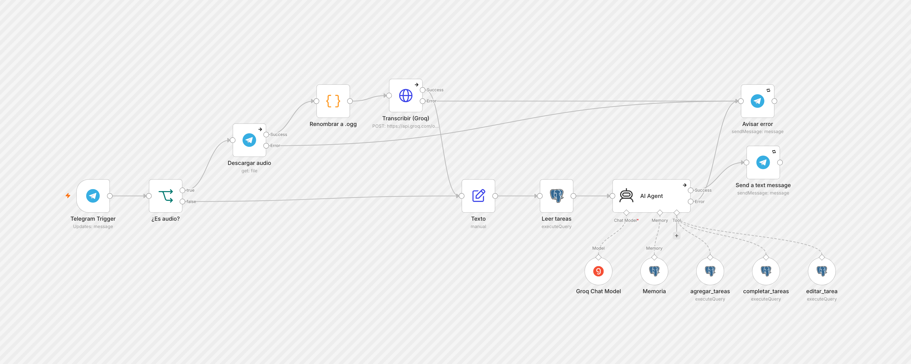
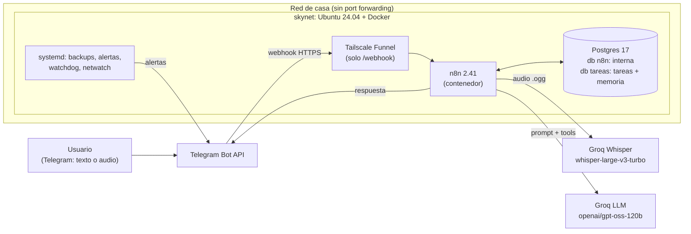
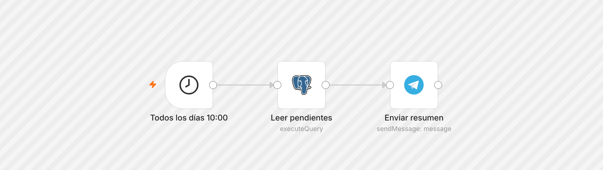

# Skynet: asistente personal en Telegram con n8n en un homelab

Asistente personal por Telegram que entiende **texto y notas de voz**, conversa sobre cualquier tema y administra una **lista de tareas** guardada en Postgres. Todo corre en un servidor casero (una PC vieja reciclada) con **n8n en Docker**, sin puertos abiertos en el router y con **costo cero**.



## Qué hace

- Responde preguntas generales como cualquier chat con un LLM.
- Detecta cuando hablás de tareas ("recordame...", "tengo que hacer X para el viernes", "ya terminé lo del banco") y usa herramientas para **agregar, completar (borrar) o editar** tareas en la base.
- Acepta **audios**: los transcribe con Whisper y los procesa igual que un mensaje escrito, mostrando primero lo que entendió.
- Recuerda el contexto reciente de la conversación (memoria en Postgres).
- Tiene un **tope de 20 tareas pendientes**: si se supera, no agrega nada y pide resolver tareas antes de sumar nuevas.
- Todos los días a las **10:00** manda por Telegram el resumen de tareas pendientes.

## Arquitectura



**Por qué así:**

| Decisión | Motivo |
|---|---|
| n8n self-hosted en Docker Compose | Orquestación visual, versionada en un solo `compose.yaml`, datos en bind mounts (backup simple). |
| Postgres compartido, base `tareas` separada | Un solo motor para mantener, pero los datos de la app aislados de la base interna de n8n. |
| Tailscale Funnel solo para `/webhook` | Telegram necesita un endpoint HTTPS público. Funnel lo da sin abrir puertos en el router y **sin exponer el editor de n8n**, que queda solo en LAN / tailnet. |
| Groq (free tier) para LLM y Whisper | Una sola API key, tool calling confiable, transcripción en menos de 1 segundo. 1000 requests/día de LLM y 2000 audios/día gratis. |
| Agente con herramientas (tool calling) | El modelo decide cuándo tocar la lista; si la charla no es sobre tareas, responde normalmente. |

## El servidor (skynet)

Una PC de escritorio vieja convertida en servidor 24/7:

| | |
|---|---|
| CPU | Intel Core 2 Duo E7500 (2 núcleos) |
| RAM | 7.6 GB + 4 GB swap |
| Disco | SSD 98 GB (LVM) |
| SO | Ubuntu Server 24.04.5 LTS |
| Red | WiFi USB (driver `rt2800usb`), sin cable |

### Hardening y operación

- **SSH**: solo con clave pública, `PermitRootLogin no`, `MaxAuthTries 4`. La contraseña solo se acepta desde la LAN (`Match Address`).
- **Firewall**: UFW activo y **fail2ban**.
- **Acceso remoto**: Tailscale (sin IP pública ni port forwarding). Script [`skynet-remoto`](server/scripts/skynet-remoto) para prender/apagar el acceso y ver el estado (`--json` pensado para automatizar).
- **Watchdog de hardware**: se carga el módulo `iTCO_wdt` ([unit](server/systemd/skynet-watchdog-load.service)) y systemd lo alimenta ([`99-skynet-watchdog.conf`](server/systemd/99-skynet-watchdog.conf)). Si el sistema se congela más de 60 s, la placa reinicia sola.
- **WiFi autorreparable**: [`skynet-netwatch`](server/scripts/skynet-netwatch) corre cada 5 min. Con 3 fallos seguidos reinicia `wpa_supplicant`, con 6 recarga el driver. Además el power-save del WiFi queda desactivado ([unit](server/systemd/wifi-powersave-off@.service)).
- **Alertas a Telegram**: [`server-alerts`](server/scripts/server-alerts) corre cada 5 min y avisa por Telegram (con cooldown) sobre: reinicios inesperados vs. limpios, temperatura de CPU, disco e inodos, SMART del SSD, RAM y swap, servicios systemd caídos, watchdog, red (router / internet / DNS), contenedores Docker caídos o `unhealthy`, antigüedad del último backup, errores de hardware (rasdaemon) y errores nuevos de kernel.
- **Backups diarios**: [`n8n-backup`](server/scripts/n8n-backup) a las 03:30 (timer systemd). Incluye `pg_dump`, export de workflows y credenciales (encriptadas), `.env` y `compose.yaml`. Retención: 7 días los diarios y 29 días los semanales.

## Stack n8n

[`n8n/compose.yaml`](n8n/compose.yaml) levanta dos servicios:

- **postgres:17-alpine** con healthcheck (`pg_isready`). n8n arranca solo cuando la base está sana.
- **n8n 2.41.3** con Postgres como base, binarios en filesystem, task runners activados, telemetría apagada, poda automática de ejecuciones (14 días / 10.000) y healthcheck sobre `/healthz`.

Los secretos van en `.env` (`chmod 600`), ver [`n8n/.env.example`](n8n/.env.example).

## Workflows

### 1. Telegram asistente + tareas

[`n8n/workflows/telegram-asistente-tareas.json`](n8n/workflows/telegram-asistente-tareas.json) (imagen arriba)

1. **Telegram Trigger**: recibe mensajes. Filtra por chat y usuario permitidos.
2. **¿Es audio?**: si el mensaje trae `voice` o `audio`, va por la rama de transcripción:
   - **Descargar audio**: Telegram `getFile` con descarga binaria.
   - **Renombrar a .ogg**: Telegram manda las notas de voz como `.oga` y la API de Whisper rechaza esa extensión aunque el contenido sea OGG/Opus válido. Renombrar alcanza; no hace falta convertir.
   - **Transcribir (Groq)**: `POST /openai/v1/audio/transcriptions` multipart, `whisper-large-v3-turbo`, idioma `es`.
3. **Texto**: unifica ambas ramas en un campo `texto` y marca `es_audio`.
4. **Leer tareas**: una sola consulta que devuelve `n` y la lista ya armada (`#id texto`).
5. **AI Agent** con:
   - **Groq Chat Model** (`openai/gpt-oss-120b`, temperatura 0.2).
   - **Memoria**: Postgres Chat Memory, ventana de 5 interacciones por chat.
   - **Herramientas** (nodos Postgres como tools, parámetros con `$fromAI`):
     - `agregar_tareas`: inserta varias tareas en un solo statement, **validando el tope de 20 en SQL**.
     - `completar_tareas`: borra por IDs y devuelve qué borró.
     - `editar_tarea`: cambia el texto de una tarea.
   - System prompt con la fecha actual, la cantidad `N/20` y la lista completa.
6. **Send a text message**: si fue audio antepone `Escuché: "..."`. Ante cualquier error (descarga, transcripción o LLM) avisa por Telegram en vez de quedar en silencio. Los envíos reintentan hasta 3 veces.

### 2. Resumen diario 10:00

[`n8n/workflows/resumen-diario-10am.json`](n8n/workflows/resumen-diario-10am.json)



Cron `0 10 * * *` (America/Argentina/Buenos_Aires), una consulta SQL y un mensaje. **No usa LLM**: es determinista, no gasta cuota y no puede fallar por el modelo. Si la lista llegó a 20, agrega el aviso de tope.

## Base de datos

[`sql/schema.sql`](sql/schema.sql)

```sql
CREATE TABLE tasks (
  id         serial PRIMARY KEY,
  text       text NOT NULL,
  created_at timestamptz DEFAULT now()
);
```

Sin columna de estado: **terminada = borrada**. Los IDs son estables, así "terminé la 12" sigue apuntando a la misma tarea aunque se borren otras durante el día. La tabla `n8n_chat_histories` (memoria) la crea n8n automáticamente.

### Cómo funciona la memoria

El LLM no guarda estado entre llamadas. En cada mensaje n8n lee los últimos registros de `n8n_chat_histories` para la sesión `tg-<chat_id>` y los manda junto con el prompt; al terminar guarda el nuevo intercambio. Con ventana 5 se leen los últimos 10 registros (los mensajes de herramientas también cuentan). La lista de tareas **no depende de la memoria**: se lee de la tabla en cada mensaje, así que siempre está actualizada.

## Problemas encontrados y cómo se resolvieron

| Problema | Causa | Solución |
|---|---|---|
| El bot fallaba al usar herramientas de forma intermitente | `openrouter/free` elige un modelo al azar por request; algunos no hacen tool calling bien. Además, límite de 50 req/día. | Modelo fijo en Groq con tool calling probado (1000 req/día). |
| Groq rechazaba las notas de voz | Telegram usa extensión `.oga`; la API valida por extensión. | Nodo Code que renombra a `audio.ogg` / `audio/ogg`. |
| Respuestas duplicadas, tareas duplicadas y errores 429 | "Leer tareas" devolvía una fila por tarea y n8n ejecuta el agente **una vez por item**: con 6 tareas, 6 agentes en paralelo. | La consulta devuelve una sola fila agregada (`count` + `string_agg`). |
| Textos con comas se partían en varios parámetros | El nodo Postgres separa por coma los Query Parameters cuando son string. | Pasar los parámetros como array: `{{ [ $fromAI(...) ] }}`. |
| Riesgo de pasar el tope de 20 si el modelo ignora el prompt | Las reglas solo en el prompt no son garantía. | Validación dentro del `INSERT` (CTE con conteo). Si no entra, devuelve `TOPE` y no inserta nada. |
| `ECONNRESET` esporádico al enviar a Telegram | Corte de conexión transitorio. | Retry on fail (3 intentos) en los nodos de envío. |

## Costos

| Componente | Costo |
|---|---|
| Servidor | PC reciclada (solo electricidad) |
| n8n, Postgres, Docker, Ubuntu | Open source |
| Tailscale + Funnel | Plan personal gratuito |
| Groq LLM + Whisper | Free tier |
| Telegram Bot API | Gratis |

## Estructura del repo

```
n8n/
  compose.yaml                 stack n8n + Postgres
  .env.example                 variables necesarias
  workflows/
    telegram-asistente-tareas.json
    resumen-diario-10am.json
sql/
  schema.sql                   base "tareas"
server/
  scripts/                     n8n-backup, server-alerts, skynet-netwatch, skynet-remoto
  systemd/                     services, timers y config del watchdog
docs/img/                      capturas de los workflows
```

## Cómo reproducirlo

1. Ubuntu Server con Docker y Docker Compose. Copiar `n8n/` a `/opt/stacks/n8n`, crear `.env` a partir de `.env.example` y `docker compose up -d`.
2. Crear la base de la app:
   ```bash
   docker compose exec postgres psql -U "$POSTGRES_USER" -d postgres -c "CREATE DATABASE tareas"
   docker compose exec -T postgres psql -U "$POSTGRES_USER" -d tareas < ../../sql/schema.sql
   ```
3. Exponer solo los webhooks con Tailscale Funnel (`/webhook` hacia `http://127.0.0.1:5678/webhook`) y poner esa URL en `WEBHOOK_URL`.
4. En n8n crear las credenciales: **Telegram** (token de @BotFather), **Postgres** (host `postgres`, base `tareas`) y **Groq** (API key de console.groq.com).
5. Importar los dos JSON de `n8n/workflows/`, asignar las credenciales, reemplazar `TU_CHAT_ID` / `TU_USER_ID` y activar.
6. Opcional: copiar `server/scripts` a `/usr/local/sbin` y `server/systemd` a `/etc/systemd/system`, luego `systemctl daemon-reload` y habilitar los timers.

## Próximos pasos

- Incluir la base `tareas` en el `pg_dump` del backup diario (hoy respalda solo la base de n8n).
- Copia de los backups fuera del servidor.
